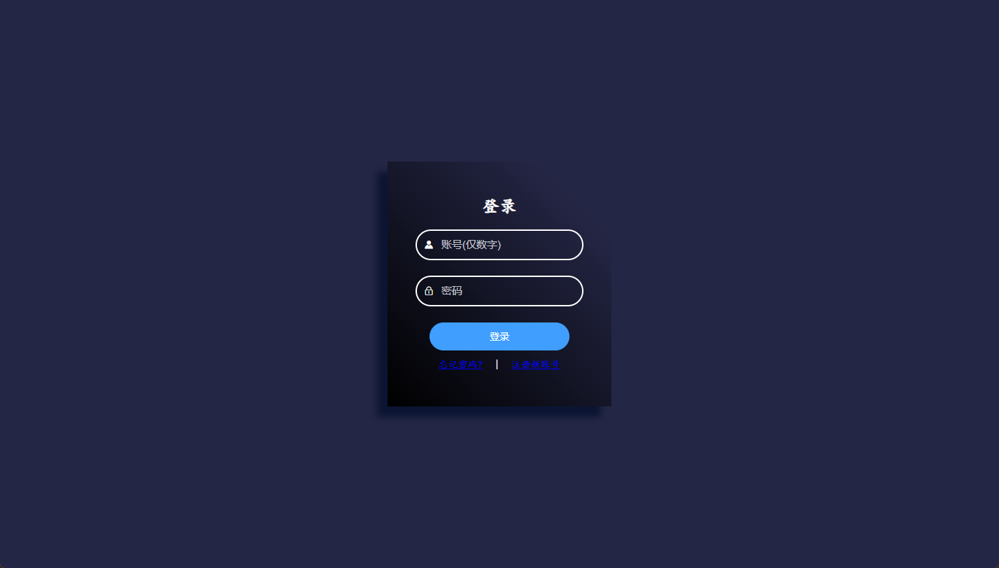
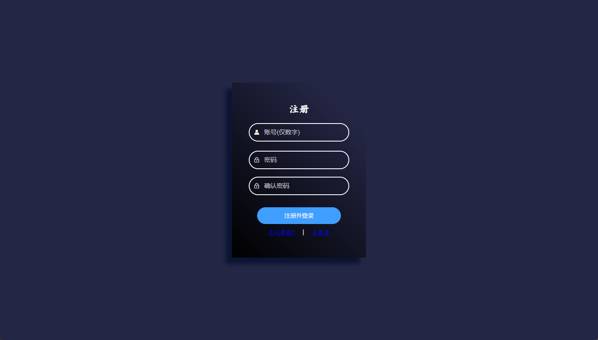
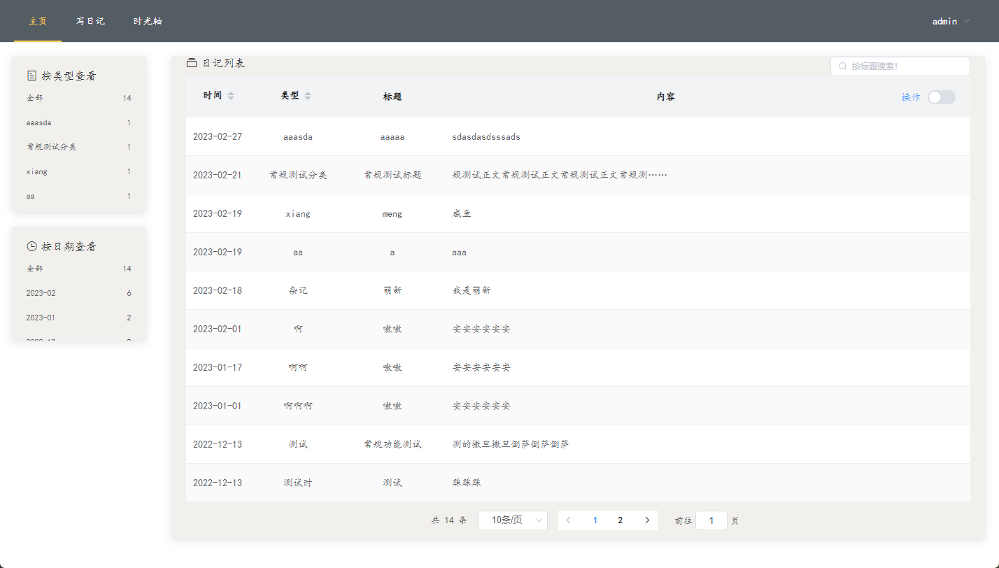
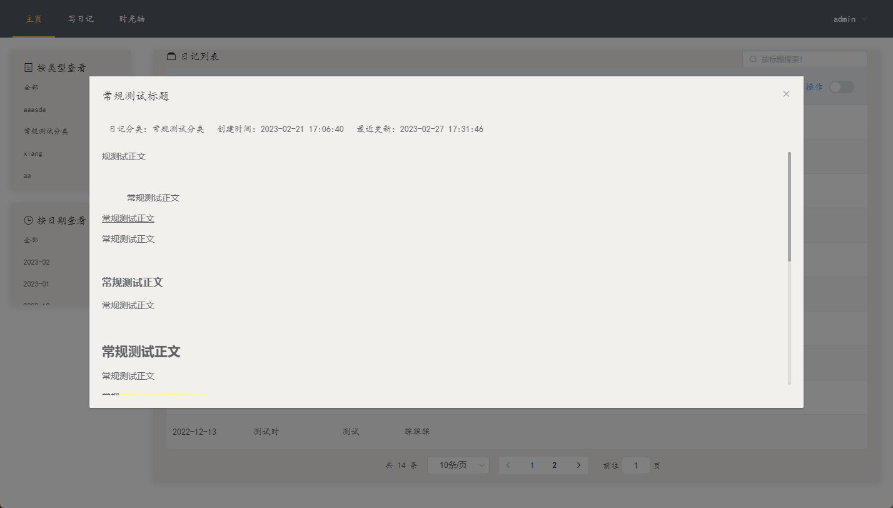

# 个人日记系统

## 前言

个人的毕业设计作品，Spring boot + Vue结构

## 项目流程

- 账号系统
    - 注册页
    - 登录页
- 日记系统
    - 日记列表
    - 日记编写
    - 时光轴

## TODO

- 用户管理
    - [x] 登录、退出
    - [x] 注册
    - [ ] 个人信息修改

- 日记主页
    - [x] 列表
    - [x] 分类、筛选
    - [x] 搜索
    - [x] 操作(查看、编辑 、删除)
- 写日记
    - [x] 标题、类型、正文
    - [x] 富文本支持
    - [ ] 图片、视频
- 时光轴
    - [ ] 待处理
- 分类管理
    - [ ] 更名、删除

## 界面展示

- 登录注册页

- 主页

- 日记编写

